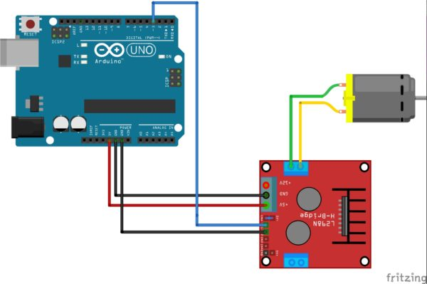

# Controle develocidade de um motor CC por modulação PWM

# Descrição
  PWM significa "Pulse Width Modulation" ou Modulação de Largura de Pulso, ou seja, através da largura do pulso de uma onda quadrada é possível o controle de potência ou, no nosso caso, velocidade do motor de corrente contínua.
  
  
# Sumário 

# Pré-Requisitos:
  Para reproduzir o projeto deste post, você precisará de: um Arduino UNO (com cabo USB para programação), um Driver Motor Ponte H L298n, um Motor DC 3-6V com Caixa de Redução e Eixo Duplo, uma Fonte DC Chaveada 9V 1A Plug P4, jumpers (macho-fêmea e macho-macho).
  
# PWM no Arduíno
No caso dos motores DC, a “velocidade de giro” (RPM) pode ser controlada variando-se sua tensão de alimentação. Além disso, o RPM é diretamente proporcional à tensão aplicada. Portanto, variando-se a tensão média de alimentação do motor, varia-se o RPM do mesmo.

Isso significa que:;

Duty cycle de 0%: tensão média igual a 0V, logo o motor fica parado;

Duty cycle de 50%: tensão média igual a 50% da tensão de alimentação do motor, logo este girará com RPM igual a metade de sua rotação máxima;

Duty cycle de 100%: tensão média igual a tensão de alimentação do motor, logo este girará com RPM igual a sua rotação máxima.

A programação do Arduino (incluindo o Arduino UNO, utilizado neste post) já possui uma função nativa para gerar um sinal PWM em alguns dos pinos (aqueles identificados com um símbolo/identificação ~). Isso torna muito mais fácil o desenvolvimento dos projetos que envolvem PWM, permitindo fácil utilização do mesmo com pouquíssimo custo em termos computacionais (uso de memória Flash, RAM e processamento) e escrita de códigos-fonte mais limpos e curtos. Tal função é chamada de analogWrite(), e recebe dois parâmetros, conforme abaixo:

analogWrite(PINO, VALOR_ANALOGICO);
Onde:
PINO: número do pino do Arduino o qual se deseja que o sinal PWM seja gerado.
Conforme dito anteriormente, somente pinos com símbolo/identificação ~ podem gerar sinais PWM.

VALOR_ANALOGICO: valor (de 0 a 255), proporcional ao Duty Cycle a ser gerado.
Ou seja, para Duty Cycle de 100%, deve-se utilizar valor 255, já para Duty Cycle 20% deve-se utilizar o valor 51 e assim por diante.

# Diagramas 

  Diagrama do fritzing

# Código Fonte 
https://github.com/VitorMonteiroDeFranca/ControlePWM/blob/master/codigo#L3
